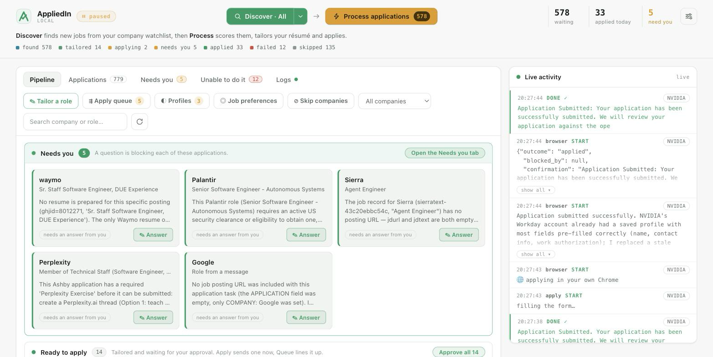
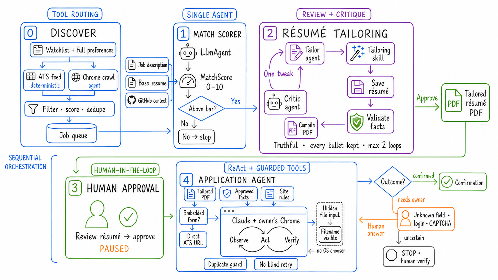
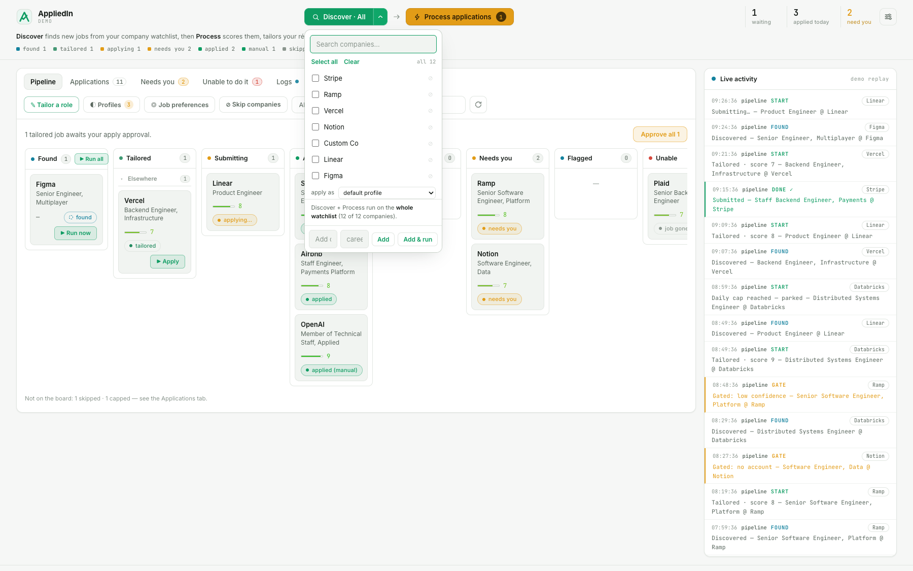
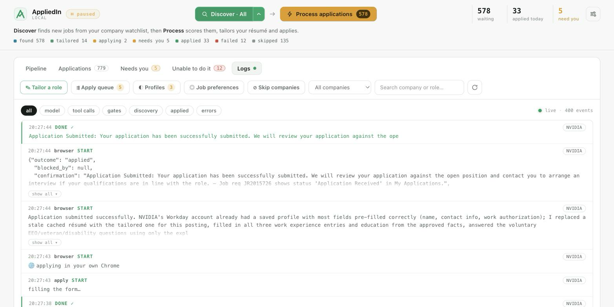
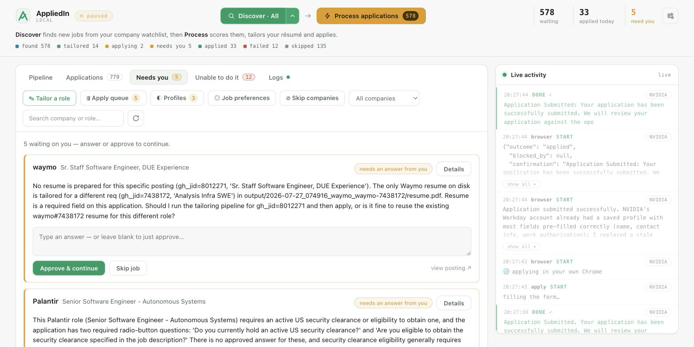

# AppliedIn

**An agentic workflow that finds matching roles, tailors your resume, and automates job applications—with you in control.**

[](https://www.python.org/)
[](https://google.github.io/adk-docs/)
[](#privacy-and-data)
[](LICENSE)

AppliedIn turns a job search into a reviewable pipeline:

**discover → score → tailor resume → review → approve → apply**

This is not one large prompt or a form-filling script. It is a deep agentic graph
of specialized agents:

1. a **discovery agent** finds and normalizes job postings;
2. a **scorer agent** returns a structured match score;
3. a **tailor agent** edits the resume for that specific role;
4. a **critic agent** reviews the edit and loops it back when needed;
5. deterministic tools validate truthfulness and compile the resume PDF;
6. a **human gate** waits for approval or a missing answer;
7. a **browser agent** fills the employer form and verifies confirmation.

The graph combines multi-agent orchestration, review-and-critique loops, tool
use, durable state, and human-in-the-loop control. The default mode stops before
every submission.



> Start with one job URL. You can see a tailored resume before configuring
> discovery or browser automation.

> ⚠️ **Important:** the complete workflow needs an OpenAI API key for discovery,
> scoring, and resume tailoring, plus an active direct Claude
> subscription (Pro, Max, Team, or Enterprise) for the Chrome agent that fills
> and submits applications.

## Agentic workflow at a glance



## Why AppliedIn

Most application tools optimize for volume. AppliedIn optimizes for control and
traceability:

- **One resume per role.** It rewords and reorders existing experience toward
  the job description without inventing experience.
- **A visible agent workflow.** Scores, model actions, gates, failures, resume
  diffs, and submission confirmations appear in the dashboard.
- **Human approval by default.** A tailored application waits for you to press
  **Apply**.
- **Answers are reused.** Approved answers are stored locally and reused when a
  future form asks the same question.
- **Durable execution.** Redis-backed queues and tracked states let the workflow
  continue across long-running model and browser steps.
- **Browser handoff.** Login walls, CAPTCHAs, and uncertain submissions stop for
  a person instead of being guessed around.

## Start in about five minutes

The quickest path creates one tailored resume. Automatic form submission is
optional and can be enabled later.

### What you need

| For | Required |
| --- | --- |
| Dashboard, scoring, and resume tailoring | macOS or Linux, an OpenAI API key, Redis, and a self-contained LaTeX resume |
| Automatic application submission | Everything above, plus Chrome or Edge, Claude Code, the Claude browser extension, and an active direct Claude subscription: Pro, Max, Team, or Enterprise |
| Development | Python 3.12; `uv` is installed by the setup script |

macOS is the smoothest setup because `./appliedin setup` can install Redis and
Tectonic through Homebrew. On Linux, install those two system packages with your
package manager before continuing.

In short:

- **OpenAI API key:** required to discover, score, and tailor resumes.
- **Claude subscription:** required to fill and submit applications in Chrome.

### 1. Clone and install

```bash
git clone https://github.com/sayantan94/AppliedIn.git
cd AppliedIn

cp .env.example .env
./appliedin setup
```

Installs Python 3.12, the project dependencies, and the local tooling it can
detect. `./appliedin` is the only script you need: `start` runs setup for you
whenever the dependencies have moved.

### 2. Add your OpenAI API key

Open `.env` and replace the placeholder:

```dotenv
OPENAI_API_KEY=sk-your-key-here
APPLIEDIN_APPLY_MODE=gated
```

`gated` is the safe default: roles are scored and resumes are tailored, but
nothing is submitted until you approve it.

Only the OpenAI key is required for the tailoring-only first run. The full
application workflow also requires Claude Code and an active direct Claude
subscription.

### 3. Add your resume

AppliedIn currently uses LaTeX as the editable source of truth:

```bash
mkdir -p resume
cp "/path/to/your-resume.tex" resume/base.tex
tectonic resume/base.tex
```

`resume/base.tex` must compile and should be one self-contained file. Avoid
external `\input`, image, font, or style-file dependencies because tailored
copies are compiled in an isolated temporary directory.

Your real resume is git-ignored.

### 4. Start AppliedIn

```bash
./appliedin start --no-discover
```

That is the whole command. `start` installs anything missing, brings up Redis,
and checks your key and resume before launching, so it either starts properly or
tells you exactly what is missing. `--no-discover` leaves the scheduled crawler
off, which is what you want for a first run.

It runs in the background and logs to `.local/daemon.log`. `./appliedin status`,
`./appliedin logs` and `./appliedin stop` do what they say.

Open [http://127.0.0.1:8787](http://127.0.0.1:8787), click **Tailor a role**,
paste a public job URL, and click **Tailor resume**.

The role will move through scoring and tailoring, then land in the **Tailored**
lane. Open the card to inspect:

- its match score and reasoning;
- the generated resume PDF;
- exactly what changed from `resume/base.tex`;
- the approval gate before applying.

That is the smallest useful end-to-end test. No watchlist scan and no browser
submission are needed.

## Configure your job search

After the one-role flow works, configure discovery.

### Set your preferences

Use **Job preferences** in the dashboard or edit
[`config/preferences.yaml`](config/preferences.yaml):

- target titles and seniority;
- skills or domains that raise the match;
- excluded keywords;
- preferred locations;
- hard rules such as “no security clearance”;
- minimum match score;
- maximum new roles to tailor per company run.

Preferences are used by both the early relevance filter and the deeper per-job
scorer.

### Choose companies

Edit [`config/watchlist.yaml`](config/watchlist.yaml) or add a company from the
dashboard. AppliedIn resolves common ATS providers such as Greenhouse, Lever,
Ashby, and Workday, then falls back to a browser crawl for custom career sites.



*Run discovery against one company, a selected group, or the full watchlist.*

For the first discovery run, select one to three companies instead of scanning
the full example watchlist. This gives you faster feedback and keeps model usage
predictable.

Then:

1. Press **Discover** to fetch and queue matching roles.
2. Press **Process applications** to score and tailor the discovered backlog.
3. Review jobs in the **Tailored** lane.
4. Press **Apply** only when the resume and job details look right.

The daemon also schedules discovery every six hours by default. Change
`APPLIEDIN_DISCOVER_INTERVAL_SEC` in `.env` if needed.

## Add application facts

AppliedIn keeps approved form answers in `.local/facts.md`. The file is created
after the app starts and is git-ignored.

You can let the workflow ask for missing answers, or seed common facts yourself:

```markdown
## global
- **Full name**: Your Name
- **Email**: you@example.com
- **Phone**: +1 555 555 5555
- **Work authorization**: Authorized to work in the United States
- **Requires sponsorship**: No
```

Use the dashboard's **Profiles** menu for the email and phone that should appear
on an application. AppliedIn re-renders the tailored resume with the selected
profile so the form and PDF do not disagree.

Do not prefill voluntary demographic answers unless you intentionally want them
used. Unknown protected-characteristic fields are left unanswered.

## Claude subscription required for application submission

Tailoring works without Claude. Submitting through the default `chrome` engine
requires:

1. Google Chrome or Microsoft Edge.
2. [Claude Code](https://code.claude.com/docs/en/overview).
3. The
   [Claude browser integration](https://code.claude.com/docs/en/chrome).
4. An active direct Claude Pro, Max, Team, or Enterprise subscription.

Check the connection before asking AppliedIn to submit:

```bash
claude --version
claude --chrome
```

Inside Claude Code, run `/chrome` to inspect or reconnect the browser extension.
The Chrome integration uses the browser's current login state. It requires the
direct Claude subscription above.

Keep this setting in `.env`:

```dotenv
APPLIEDIN_APPLY_ENGINE=chrome
```

Start in `gated` mode. Once you trust your preferences, resume output, saved
answers, and browser behavior, the dashboard can switch to `auto`.

| Apply mode | Behavior |
| --- | --- |
| `gated` | Tailors every qualifying resume and waits for your approval before submission. |
| `auto` | Automatically submits roles at or above `APPLIEDIN_AUTO_MIN_SCORE`. |
| `assisted` | Stops at tailored; the local [`extension/`](extension/) helps you finish in your browser. |

AppliedIn does not solve CAPTCHAs. It hands login, CAPTCHA, and ambiguous form
states back to you.

## The agentic workflow, step by step

AppliedIn uses Google ADK to coordinate specialized agents inside a durable,
stateful pipeline. The graph is defined in
[`src/agent/graph.py`](src/agent/graph.py).



*Every model step, tool call, human gate, failure, and confirmed submission is
visible and filterable.*

### What each stage does

1. **Discover.** Feed adapters and a browser-capable discovery path inspect the
   selected company boards, normalize postings, deduplicate them, and place
   matching jobs on a durable queue.
2. **Score.** The scorer agent compares one job with the base resume and job
   preferences. It returns a typed `0–10` result. Low matches stop with a reason.
3. **Tailor.** The tailor agent conservatively rewords and reorders existing
   resume content around the job description. It cannot add unsupported
   experience.
4. **Validate.** Deterministic tools check that bullets and anchored facts were
   not dropped, then compile a PDF. A failed validation goes back for repair.
5. **Critique.** The critic agent evaluates the tailored resume. It either exits
   the loop or sends one focused revision back to the tailor.
6. **Gate.** The completed resume waits in the **Tailored** lane. Gated mode
   requires a person to approve it; missing facts always become human questions.
7. **Apply.** After approval, the browser agent opens the posting in the user's
   browser, fills fields from approved facts, uploads the tailored resume, and
   submits.
8. **Verify.** The workflow records `applied` only when it sees a real
   confirmation. Login walls, CAPTCHAs, and uncertain outcomes stop in a visible
   state instead of being retried blindly.



*The graph pauses visibly when it needs approval, an answer, or a browser login.*

### Agentic patterns used in the graph

| Pattern | Where it appears |
| --- | --- |
| Sequential workflow | score → tailor → review → approval → apply |
| Review and critique loop | the critic sends weak resume edits back to the tailor |
| Structured output | the scorer returns a typed match result instead of free-form text parsing |
| Tool use | agents fetch job descriptions, validate facts, compile PDFs, and control the browser |
| Human in the loop | approval, missing answers, logins, and CAPTCHAs pause for the owner |
| Durable state and idempotency | Redis queues, tracked statuses, deduplication, and duplicate-submit guards |
| Bounded autonomy | score thresholds, gated mode, truthfulness checks, and confirmation-required completion |

Each role moves through explicit states:

```text
found → tailoring → tailored → submitting → applied
                     ↘ needs_human
                     ↘ failed / uncertain
```

## Guardrails

Important boundaries are enforced in code:

- The tailor cannot silently drop resume bullets.
- Key facts from the base resume are validated before a tailored copy is saved.
- Job titles and employers are not upgraded or invented.
- A tracked application marked as applied is refused before another submission.
- An application is not marked applied unless the destination page shows a
  confirmation.
- Unknown protected-characteristic answers are left blank.
- CAPTCHAs are never solved automatically.

Generated text can still be wrong. Review the resume, answers, and employer terms
before submitting an application under your name.

## Everyday commands

```bash
./appliedin start                 # dashboard, workers, scheduled discovery
./appliedin start --no-discover   # dashboard + workers, no scheduled crawling
./appliedin status                # daemon health and pipeline counts
./appliedin logs                  # follow .local/daemon.log
./appliedin stop                  # stop the daemon

./appliedin discover              # one discovery pass
./appliedin work                  # process the queued roles
./appliedin run                   # discover, then process
./appliedin resume <pk> "<answer>" # answer a human gate from the CLI
```

## Configuration

The most useful environment variables are:

| Variable | Default | Purpose |
| --- | --- | --- |
| `OPENAI_API_KEY` | required | scoring, tailoring, critique, and writing |
| `APPLIEDIN_APPLY_MODE` | `gated` | `gated`, `auto`, or `assisted` |
| `APPLIEDIN_AUTO_MIN_SCORE` | `8` | minimum score for automatic submission |
| `APPLIEDIN_APPLY_ENGINE` | `chrome` | browser submission engine |
| `APPLIEDIN_ORCHESTRATOR_MODEL` | `openai/gpt-5-mini` | fallback model for agent stages |
| `APPLIEDIN_TAILOR_MODEL` | orchestrator model | optional tailor override |
| `APPLIEDIN_CRITIC_MODEL` | orchestrator model | optional critic override |
| `APPLIEDIN_WRITER_MODEL` | orchestrator model | optional free-text writer override |
| `APPLIEDIN_REDIS_URL` | `redis://localhost:6379/0` | local tracking and queues |
| `APPLIEDIN_WEB_PORT` | `8787` | dashboard port |
| `APPLIEDIN_DISCOVER_INTERVAL_SEC` | `21600` | discovery interval in seconds |
| `APPLIEDIN_EVAL_LANES` | `2` | concurrent scoring and tailoring workers |

See [`.env.example`](.env.example) for the full list.

## Privacy and data

AppliedIn has no hosted application backend in local mode. Runtime state is kept
under `.local/`:

```text
.local/facts.md       approved answers
.local/profiles.yaml  application identities
.local/secrets.json   saved portal credentials
.local/artifacts/     tailored resumes and screenshots
.local/daemon.log     local activity log
```

`.local/`, `.env`, `resume/base.tex`, and generated resume PDFs are ignored by
Git.

Local-first does not mean no data leaves your computer. Resume content, job
descriptions, and relevant context are sent to the model providers you configure.
When you approve an application, the browser sends the form and tailored resume
to the employer. Review the providers' data policies before using real personal
information.

## Troubleshooting

### The dashboard does not open

```bash
./appliedin status
./appliedin logs
```

If the log shows a Redis connection error:

```bash
redis-cli ping
brew services restart redis  # macOS
```

### The resume does not compile

```bash
tectonic resume/base.tex
```

Fix the first LaTeX error and make the file self-contained. AppliedIn can also
use `pdflatex` when it is installed.

### A role stays in `found`

The role has been discovered but not processed. Press **Process applications**
or run:

```bash
./appliedin work
```

### Automatic apply says Claude or Chrome is unavailable

```bash
command -v claude
claude --version
claude --chrome
```

Confirm the browser extension is enabled, Chrome is running, and `/chrome`
reports a connected integration.

### Discovery returns no jobs

- Start with one known public job URL using **Tailor a role**.
- Select one company and inspect `./appliedin logs`.
- Check the company's `careers_url` in `config/watchlist.yaml`.
- Make sure your title and location filters are not too narrow.

## Project layout

```text
src/agent/       Google ADK graph, prompts, skills, and human gates
src/discovery/   ATS adapters, resolver, crawler, and relevance filter
src/tools/       job fetch, resume validation/rendering, browser apply
src/core/        configuration, models, queues, storage, and runtime flags
src/daemon.py    dashboard server, discovery scheduler, and workers
src/server.py    local API and dashboard endpoints
web/             dashboard
extension/       assisted-application browser extension
config/          preferences and company watchlist
tests/           unit tests for core, discovery, and safety behavior
```

## Development

```bash
uv sync --group dev
uv run pytest
uv run ruff check src tests
```

Contributions that improve ATS coverage, site-specific form handling,
truthfulness checks, setup portability, tests, or documentation are welcome.
Please keep the human handoff and duplicate-submission boundaries intact.

## Responsible use

This repository is published for learning and experimentation. It is not a
hosted service, and it is not legal, employment, or career advice.

Applications are submitted under your identity. Read what the system generated,
check each employer's terms, and use automation only where you are comfortable
accepting responsibility for the result.

If this project helps you build a better job-search workflow, consider starring
the repository so other agent builders can find it.

## Contributing

Using Claude Code, Codex or another coding agent? Point it at this repo and ask
it to **"set this repo up and start the server"**. [AGENTS.md](AGENTS.md) scripts
that end to end, so the agent installs what is missing, asks you for the three
things only you have (your OpenAI key, your resume, a company or two), starts the
daemon, and checks it is actually up.

[AGENTS.md](AGENTS.md) is also the guide for changing the code: where things live,
how to add a job preference or a per site playbook, how to debug the browser
agent, and which guarantees are enforced in code and must stay there.

## License

MIT — see [LICENSE](LICENSE).
