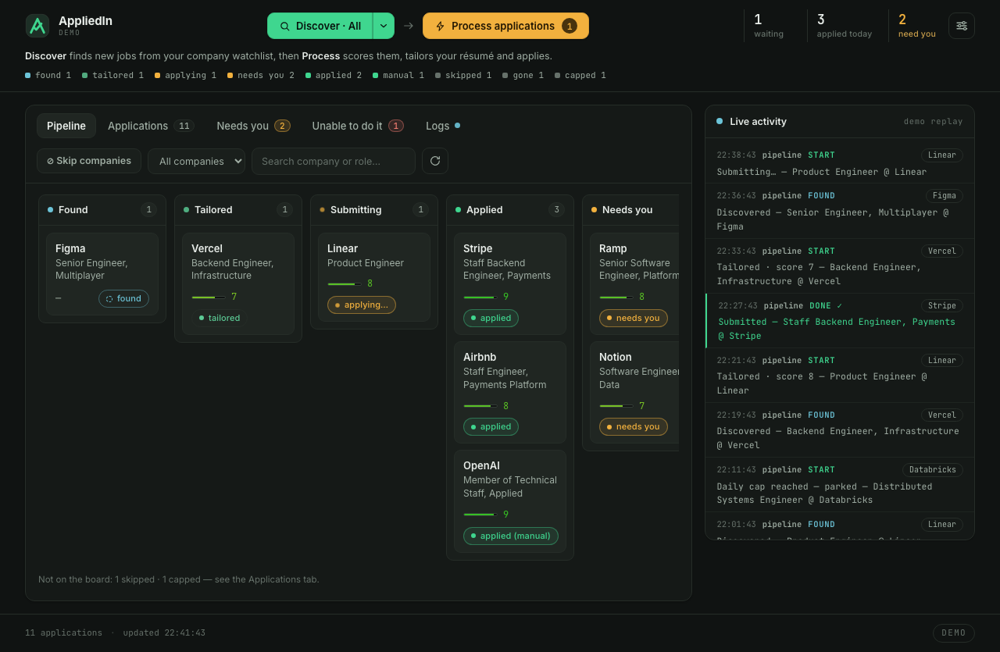
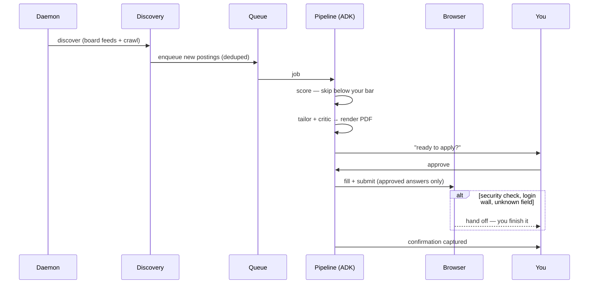

# AppliedIn

Applying to jobs is mostly retyping. The same name, the same phone number, the
same "why are you interested in this role" — a hundred times, until you stop
applying to good roles because the form is tedious.

AppliedIn does the retyping. It finds roles worth your time, tailors your résumé
to each one, fills the employer's form from answers you approved, and stops for
you only where a person is genuinely required.

**It runs entirely on your own machine.** Your résumé, your answers and your
history stay on your disk. Nothing is uploaded anywhere except to the employer
you are applying to.

> Published for learning — applications go out under **your** name, so read them
> before they are sent. See [the caveats](#️-for-learning-purposes-only).



*Jobs move **found → tailored → applied**. Every step streams to the live feed,
so you can always see what it did and why.*

## What it actually does

- **Finds roles** on your watchlist's job boards, screened against what you
  said you want — titles, seniority, locations, hard rules like "no security
  clearance". Ranked, so Seattle beats San Francisco if that's your preference.
- **Tailors your résumé** per job: rewords bullets toward the posting's own
  vocabulary, never inventing anything and never touching your job titles.
  Compiles to PDF, and shows you a diff of exactly what changed.
- **Fills the form** — name, contact, work authorisation, the awkward dropdowns,
  and drafts the free-text answers from your résumé and GitHub.
- **Stops when it should.** An unknown field, a login wall or a security check
  becomes a question for you, and your answer is remembered so it is never asked
  twice.

## Getting started

```bash
cp .env.example .env          # paste your key: OPENAI_API_KEY=sk-...
./setup.sh                    # venv, deps, Redis, Tectonic, Playwright
./appliedin start             # → http://127.0.0.1:8787
```

Two things to set up first:

1. **Your résumé** — put its LaTeX in `resume/base.tex`. This file is
   git-ignored, and the tailor only ever re-words it.
2. **What you want** — employers in `config/watchlist.yaml`, and your criteria in
   the dashboard's **Job preferences** panel (titles, keywords, locations, the
   score bar, and free-text rules).

Then press **Discover**, and **Process** when jobs appear.

```bash
./appliedin start | stop | status | logs   # daemon lifecycle
./appliedin discover | work | run          # one-shot passes, no server
./appliedin resume <pk> "<answer>"         # answer a gate from the CLI
```

## How much it applies is up to you

| Mode | What happens |
| --- | --- |
| **Gated** *(default)* | Tailors everything, applies to nothing until you press ▶ Apply. |
| **Auto** | Applies by itself to jobs scoring above your bar, up to a daily cap. |
| **Assisted** | Stops at tailored; the [browser extension](extension/) finishes each one in your own Chrome. |

**Assisted** is worth understanding. Employers increasingly challenge automated
browsers — one posting will go through untouched while the next demands a
security code. In your own browser, with your own session, that challenge usually
never appears; when it does, you are already there to clear it. The extension
opens each waiting application, fills it, and leaves you the check and Submit.

## Under the hood

Google ADK agents over a durable queue.



### Models

One key, one model, every stage — all defaulting to **`openai/gpt-5-mini`**.
Each is a full LiteLLM string, so any stage can point at another provider without
touching code.

| Stage | What it does | Env var |
| --- | --- | --- |
| Relevance | first-pass title screen | `APPLIEDIN_RELEVANCE_MODEL` |
| Scorer | rate fit 0–10 against your résumé | `APPLIEDIN_SCORER_MODEL` |
| Tailor | reword the résumé for the posting | `APPLIEDIN_TAILOR_MODEL` |
| Critic | review the tailored résumé | `APPLIEDIN_CRITIC_MODEL` |
| Writer | draft free-text answers | `APPLIEDIN_WRITER_MODEL` |
| Field mapper | match form fields to your answers | `APPLIEDIN_ORCHESTRATOR_MODEL` |
| Browser | drive Chrome when a form needs vision | `APPLIEDIN_BROWSER_MODEL` |

Unset stages fall back to `APPLIEDIN_ORCHESTRATOR_MODEL`, so one variable moves
everything. A stronger model for the writer (essays) is the usual first upgrade.

### Two engines, and when it switches by itself

`APPLIEDIN_APPLY_ENGINE` is **`scripted`** by default: a deterministic Playwright
pipeline with **no model in the click loop**. It reads the form, matches each
field to an answer you approved, and types. On a known ATS — Ashby, Greenhouse,
Lever, Workday — that is the whole apply, which is why the running cost is mostly
scoring and tailoring rather than clicking.

**It escalates on its own.** You do not choose per job:

| What happened | What it does |
| --- | --- |
| Can't find a real form (fewer than 2 fillable fields) | Re-runs the apply under **browser-use**, which can read the page visually |
| The scripted pass throws | Same — falls back to **browser-use** |
| **The browser closed or crashed** | **Stops.** Reports *uncertain* and asks you to check the portal |

That last row is deliberate. If the browser died, the form may already have been
filled and submitted, so re-running it could submit a **second** application. A
duplicate is worse than an unconfirmed one, so it never retries blind.

There is a second, narrower escalation once a form *has* been filled — deciding
who presses Submit:

- **Known ATS** → scripted submits and reads the confirmation. No model involved.
- **Unknown or custom form** → handed to the vision agent to finish and confirm.

Setting `APPLIEDIN_APPLY_ENGINE=agent` skips the scripted attempt entirely and
hands every form to browser-use: slower and pricier, but useful if you are
working with employers whose pages the scripted path cannot read.

### Site quirks

Some employers need rules the generic path can't infer — a form inside an iframe,
a combobox that ignores typed text, a confirmation with unusual wording. Each is
one markdown file in [`src/agent/skills/site-quirks/`](src/agent/skills/site-quirks/),
injected into the apply for that site only. Adding a site is one file, no code.

## Checking it without spending anything

These drive the real code paths with Playwright and **no model calls**, so they
cost nothing to run as often as you like:

```bash
.venv/bin/python scripts/verify_form_targeting.py   # finds the real form, ignores cookie banners
.venv/bin/python scripts/verify_submit_path.py      # fill → submit → confirmation, local fixture
.venv/bin/python scripts/fill_form_demo.py <url>    # fills a real posting, screenshots, never submits
.venv/bin/python scripts/survey_company_forms.py    # what each employer's form will demand
```

## Layout

```
src/core/       models, config, stores factory, storage backends
src/discovery/  board feed adapters, ATS resolver, crawler, relevance filter
src/tools/      résumé render/diff, JD fetch, the browser apply engine
src/agent/      ADK graph (score→tailor→apply), skills/, site-quirks/
src/daemon.py   the always-on process (discovery + workers + web)
src/server.py   dashboard, API, extension endpoints
web/            the dashboard          extension/  assisted-apply driver
scripts/        no-cost verification and survey tools
```

## Requirements

Python 3.12, Redis, Chrome, and an OpenAI API key. `setup.sh` handles the rest.

## ⚠️ For learning purposes only

This is a personal project published to learn from and build on — not a product,
a service, or advice.

- **Applications go out under your name.** Read them before they are sent. An
  application you didn't check is still one you signed.
- **Employers' terms may prohibit automated applications.** Check them. Where you
  point this, and whether you should, is your call and your responsibility.
- **It never solves CAPTCHAs or bot checks.** When one appears the run stops and
  hands you the page. That boundary is deliberate — please leave it in.
- **No warranty.** It gets things wrong. The failure modes are documented rather
  than hidden, which is the most useful thing about reading the code.

---

## Licence

MIT — see [LICENSE](LICENSE).
