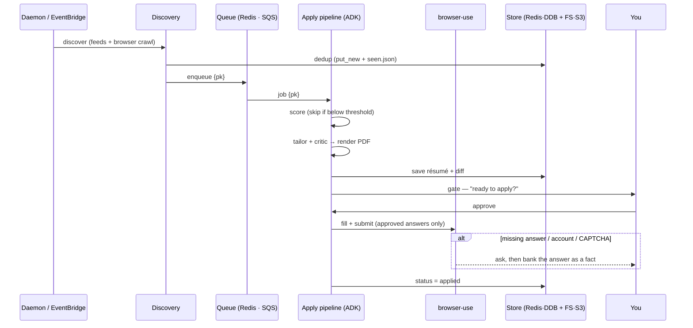

# AppliedIn

Autonomous, agentic job-application pipeline. It finds jobs, tailors your résumé
to each one, and applies through the company's portal — pausing for you only at
the moments that need a human (approving a submission, or a fact it hasn't been
told). One codebase, two modes: local on your Mac, or cloud on AWS.

## How it works

The pipeline is Google ADK agents over a durable queue. Discovery finds jobs and
enqueues them; each job then runs through a sequential agent graph:

- **score** — an LLM rates fit 0–10 against your résumé + the JD; anything below
  your `min_match_score` is skipped before any tailoring is wasted on it.
- **tailor → critic** — a light-touch loop rewords the résumé's bullets toward
  the JD's vocabulary (never inventing facts, never touching your titles or
  summary), compiles it to PDF (Tectonic), and saves it — with a "what changed"
  diff.
- **apply** — human-gated by default (approve first); flip **auto ☾** and jobs
  scoring ≥ your threshold apply themselves, up to a daily cap, while you sleep.
  The browser uploads the tailored résumé and fills every field from your approved
  facts; a **writer** model drafts any free-text answers ("why this role?") from
  your résumé + GitHub. If a required field is genuinely unknown, or a CAPTCHA
  blocks the submit, it stops and asks you — your answer is banked as a fact and
  never asked again.

Everything streams to a live dashboard — every agent step's input and output,
grouped by job, plus a screenshot of what the browser saw.



## Models

Every stage runs on the model that fits it — cheap where the judgment is
mechanical, stronger where writing quality matters. Each is a full LiteLLM string,
so you can mix providers, and each is overridable by its own `APPLIEDIN_*_MODEL`
env var (`APPLIEDIN_ORCHESTRATOR_MODEL` is the base the agents fall back to).

| Stage | What it does | Default model | Env var |
| --- | --- | --- | --- |
| Relevance | stage-1 title screen | `openai/gpt-5-mini` | `APPLIEDIN_RELEVANCE_MODEL` → orchestrator |
| Scorer | rate fit 0–10 vs your résumé | `openai/gpt-5-mini` | `APPLIEDIN_SCORER_MODEL` → orchestrator |
| Tailor | reword the résumé for the JD | `anthropic/claude-haiku-4-5` | `APPLIEDIN_TAILOR_MODEL` |
| Critic | review the tailored résumé | `anthropic/claude-haiku-4-5` | `APPLIEDIN_CRITIC_MODEL` |
| Writer | draft free-text answers / essays | `anthropic/claude-sonnet-4-6` | `APPLIEDIN_WRITER_MODEL` |
| Applier / field-mapper | orchestrate the apply | `openai/gpt-5-mini` | `APPLIEDIN_ORCHESTRATOR_MODEL` |
| Browser | drive Chrome (crawl + apply) | `gpt-5-mini` | `APPLIEDIN_BROWSER_MODEL` |

The split in one line: **gpt-5-mini** for the high-volume mechanical work
(screening, scoring, field-mapping, driving the browser), **Haiku** for résumé
writing, **Sonnet** for the essays — they must read well and run rarely. The
browser model is deliberately separate from orchestration; a stronger vision model
(e.g. `claude-sonnet-4-6`) picks tricky dropdowns more reliably if you want it.

`APPLIEDIN_APPLY_ENGINE=agent` (the default) runs the unified engine: browser-use
fills the form (uploads the résumé, types fields, picks dropdowns by vision, drafts
essays) and a deterministic finalize step submits, reads validation errors, and
self-heals — handing off to you only for a CAPTCHA or a genuinely unknown field.

## Two modes (same code)

| | Local (your Mac) | Cloud (AWS) |
| --- | --- | --- |
| Store | Redis | DynamoDB |
| Queue | Redis list | SQS |
| Artifacts | filesystem | S3 |
| LLMs | per-stage mix (see [Models](#models)) | same models via Bedrock/hosted |
| Triggers | `daemon` (cron + queue loop + web) | EventBridge + SQS |
| UI | localhost | Vercel |

`APPLIEDIN_MODE` picks the backends via `core/stores.py`; nothing else changes.

## Run locally

```bash
# 1. cp .env.example .env, then paste your Anthropic key: ANTHROPIC_API_KEY=sk-ant-...
# 2. save YOUR résumé's LaTeX to resume/base.tex (git-ignored; the tailor edits
#    this — it never invents facts, only re-emphasizes)
# 3. list company career URLs in config/watchlist.yaml + your criteria in
#    config/preferences.yaml
./setup.sh            # one-time: venv, deps, Redis, Tectonic, Playwright/Chromium
./appliedin start     # → dashboard at http://127.0.0.1:8787
```

Daemon + CLI:

```bash
./appliedin start | stop | status | logs      # background daemon lifecycle
./appliedin discover | work | run             # one-shot passes (no server)
./appliedin resume <pk> "<answer>"            # answer a gate from the CLI
```

`setup.sh` installs everything; `appliedin start` runs the daemon detached — it
serves the dashboard, finds jobs on a schedule, tailors + applies, and waits on
you at gates (your answers become facts in `.local/facts.md`). Per-job output
(the JD + tailored résumé) lands in `output/` for inspection.

## Layout

```
src/core/       models, config, stores factory, storage interfaces + local/cloud backends
src/discovery/  feed adapters, ATS resolver, browser crawler, agentic relevance filter
src/tools/      résumé render/validate/diff, JD fetch, browser-use (apply/crawl/llm),
                per-job output, seen-list, github context, credentials, gmail
src/agent/      ADK: graph.py (score→tailor→apply), finder.py, run.py, skills/
src/daemon.py   local always-on (cron + queue + web)   src/server.py  dashboard + API
src/cli.py      start/stop/status/logs/…               src/pipeline.py  find→queue→apply
web/            live dashboard (Logs, gates, résumé PDF + diff)   infra/  AWS CDK
```
