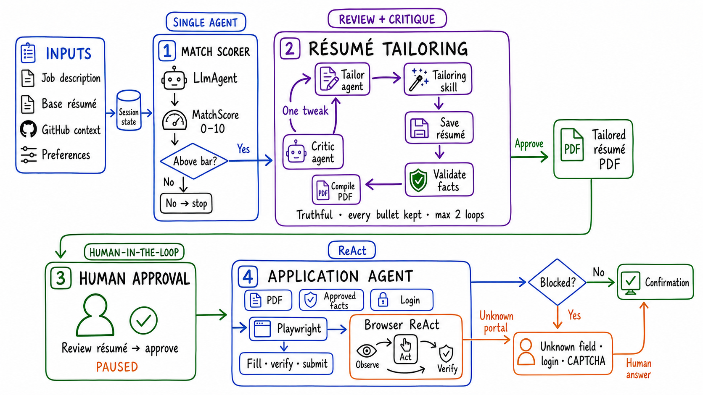

# The Agentic Workflow That Tailors Your Resume and Automates Applications

Applying to jobs is mostly retyping.

The same contact details. The same work-authorization answers. The same résumé uploaded into a different portal. After enough forms, people stop applying to good roles because the process is repetitive and exhausting.

I built **AppliedIn** to handle that repetitive work while keeping the candidate in control.

[AppliedIn is open source on GitHub](https://github.com/sayantan94/AppliedIn). It runs locally, finds relevant roles, scores them against your background, tailors a truthful résumé for each job, and fills the employer’s form using answers you already approved.

The important part is what it does **not** automate blindly. It pauses before submission. It never invents an answer. It hands login walls, unknown questions, and CAPTCHAs back to the person.

That boundary shaped the entire agent graph.

## This is not one giant agent

A common agent design puts one model at the center, gives it every tool, and asks it to solve the whole task.

AppliedIn uses a hybrid graph instead:

**Score → Tailor → Approve → Apply**

The predictable path is deterministic. Specialized agents handle the semantic work. A bounded critic loop improves the résumé. ReAct is reserved for browser situations that actually need adaptation. Human checkpoints protect facts and external side effects.

The result is more reliable, easier to inspect, and cheaper to run than asking one autonomous agent to improvise the entire workflow.

## What AppliedIn does

For every job, the system can:

- Discover roles from a configurable company watchlist
- Screen them against titles, locations, seniority, and hard preferences
- Score candidate–role fit from 0–10
- Tailor the résumé using the job description’s vocabulary
- Validate that the tailored version remains truthful
- Compile a job-specific PDF
- Show the candidate what changed
- Pause for approval
- Fill the application with approved facts
- Escalate unusual browser states to an agent or the human
- Capture the final confirmation

Everything up to submission can run as a repeatable pipeline. The candidate still owns the consequential decision.

## Stage 1: score each role with a typed contract

The first agent has one job: compare one role with the candidate’s résumé and preferences.

It returns a structured `MatchScore`, not a paragraph that downstream code has to interpret:

- Score from 0–10
- One-line reason

That output becomes an economic gate. A role below the candidate’s threshold stops before the system spends time and model calls on tailoring or browser work.

This is a small but useful agent pattern: when a task is bounded, use a focused agent with a strict output contract.

## Stage 2: tailor the résumé without rewriting reality

Résumé tailoring is the center of the graph.

The tailor receives the base résumé, job description, and relevant GitHub context. It reorders and rephrases existing experience toward the role’s vocabulary. It can emphasize what is already true, but it cannot invent a skill, inflate a title, or delete inconvenient facts.

The model does not get the final word. Its output passes through deterministic checks:

- Keep every résumé bullet
- Preserve employer, title, dates, and source facts
- Reject unsupported claims
- Compile the LaTeX successfully
- Produce a valid PDF for the application step

Then a critic agent reviews the tailored résumé against the role.

If it is truthful and reasonably aligned, the critic approves it. If one obvious emphasis is missing, it sends one focused tweak back to the tailor. The review loop is capped at two iterations.

That limit is intentional. Unbounded “make it better” loops can waste tokens, add latency, and slowly damage a good artifact. AppliedIn uses the critic for controlled self-correction, not endless optimization.

The deeper engineering principle is:

> Let the model generate. Let code enforce the invariants.

## Stage 3: pause before acting under someone’s identity

Drafting an application and submitting one are not the same kind of action.

Submission is external, identity-bearing, and sometimes irreversible. So the graph calls a long-running human tool and pauses:

**Review résumé → approve submit**

The candidate can inspect the tailored PDF and its diff before anything is sent.

Human-in-the-loop is not an error path here. It is a first-class transition in the workflow.

## Stage 4: Playwright first, ReAct when necessary

After approval, the application agent receives only trusted inputs:

- The validated tailored PDF
- Human-approved facts
- A saved login, when available

For known application systems, a deterministic Playwright engine handles the mechanical work: find the real form, map fields to approved answers, upload the résumé, verify required fields, submit, and read the confirmation.

When the page becomes genuinely dynamic—an unknown portal or stubborn custom widget—the workflow escalates to a browser ReAct agent:

**Observe → Act → Verify**

The escalation is narrow and bounded. The browser agent is not allowed to invent missing information. An unknown question, login wall, or CAPTCHA becomes a human gate, and the approved answer can be stored for the next run.

On success, AppliedIn records the confirmation and final screenshot. If a browser dies at an uncertain point, the system stops rather than retrying blindly and risking a duplicate application.

## Why the hybrid graph matters

Different parts of a real workflow have different uncertainty:

- **Sequential orchestration** fits a stable business process.
- **A focused scoring agent** fits bounded semantic judgment.
- **Review and critique** fits content with strict quality constraints.
- **ReAct** fits a browser that changes after every action.
- **Human-in-the-loop** fits missing facts and irreversible side effects.

Google Cloud’s [agentic AI design-pattern guide](https://docs.cloud.google.com/architecture/choose-design-pattern-agentic-ai-system) makes the same broader point: choose patterns based on task structure, cost, latency, and human involvement instead of defaulting to maximum autonomy.

AppliedIn turns those patterns into one working, inspectable system.

## Built for people who want to inspect the machinery

The repo includes more than the happy path:

- Google ADK agents and skills
- A durable job queue
- Local storage for résumés, answers, and history
- Per-agent model configuration through LiteLLM
- A Playwright application engine
- Browser-use fallback for visual interaction
- Site-specific rules for ATS quirks
- A live dashboard showing jobs moving from discovered to tailored to applied
- Verification scripts that exercise browser paths without spending model tokens

The project is local-first: your résumé, answer bank, and application history stay on your machine until something is sent to the employer.

## The idea I want AppliedIn to represent

Agentic does not mean autonomous everywhere.

Good agent systems place autonomy exactly where uncertainty begins:

- Keep predictable transitions deterministic.
- Use models for language and judgment.
- Validate important outputs with code.
- Bound every self-correction loop.
- Escalate only when the environment demands it.
- Put a human in control of facts and side effects.

That is the difference between an agent demo and an agentic product.

If you are building agents that interact with real websites, produce user-facing artifacts, or take actions in the outside world, I hope the graph—and the failure boundaries—are useful.

**Explore, run, or contribute to AppliedIn:**  
[github.com/sayantan94/AppliedIn](https://github.com/sayantan94/AppliedIn)

Applications still go out under your name. Review them, respect employer terms, and keep the human boundary intact.
