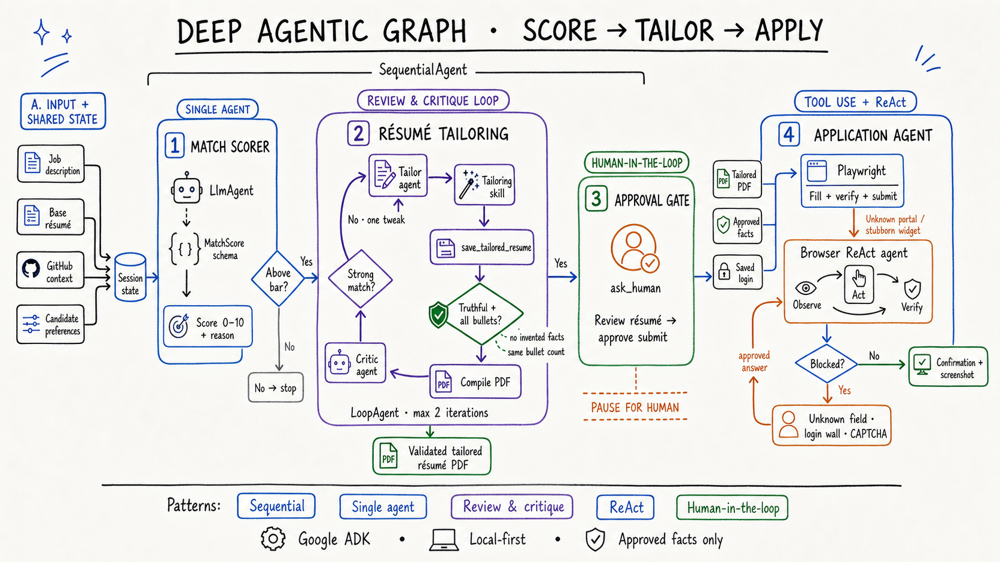

# Beyond a Single Agent: Inside a Deep Agentic Workflow for Résumé Tailoring

Most “agentic” demos put one model in the middle, surround it with tools, and let it decide everything.

That is elegant on a whiteboard. It is less convincing when the workflow can edit a résumé, open a real browser, and submit something under a person’s name.

For this system, I used a hybrid agent graph instead: deterministic orchestration for the predictable path, specialized agents for semantic work, a bounded review loop for quality, ReAct only where the environment is dynamic, and human checkpoints before irreversible actions.

## The graph has a sequential spine

The top-level workflow is deliberately simple:

**Score → Tailor → Approve → Apply**

A `SequentialAgent` moves one job through those stages in a fixed order. This does not need an LLM supervisor deciding what happens next. The business process is already known, so model-based routing would add cost and another failure mode without adding useful flexibility.

The agents share only the state they need: the job description, base résumé, GitHub context, candidate preferences, the match score, and the latest tailored artifact.

This is an important design choice: use agents for judgment, not for orchestration that ordinary code can express more reliably.

## Stage 1: score with a contract, not prose

The match scorer is a focused single agent. It compares one role with the candidate’s résumé and hard preferences, then returns a typed `MatchScore`:

- A calibrated score from 0–10
- A one-line reason
- A predictable schema that downstream code can trust

Structured output matters here. If a later step must parse an essay to discover whether the score was 7 or 8, the graph is already fragile.

The score also acts as an economic gate. Roles below the candidate’s bar stop before the system spends model calls on résumé tailoring or browser work.

## Stage 2: make résumé tailoring a bounded quality loop

Résumé tailoring is the deepest part of the graph because it has two competing goals:

1. Mirror the language and priorities of the job description.
2. Preserve every fact in the candidate’s actual experience.

A tailor agent edits the LaTeX résumé with a dedicated tailoring skill. But its output does not flow directly to the application agent. It first calls a typed save tool that behaves like a deterministic control plane.

That tool checks:

- No résumé bullet was dropped
- Employer, title, dates, and other source facts remain truthful
- The document still compiles
- A valid PDF artifact exists for the downstream browser step

Then a critic agent reviews the result against the job description. If the résumé is truthful and reasonably aligned, it exits the loop. If one obvious emphasis is missing, it returns one small revision to the tailor.

The loop is capped at two iterations.

That cap is not a limitation; it is part of the architecture. Open-ended “improve this until it is perfect” loops can burn tokens, increase latency, and sometimes make a good artifact worse. A narrow critic and a hard exit condition turn self-correction into a controlled engineering mechanism.

The broader principle is:

> Let the model generate. Let deterministic code enforce invariants.

## Stage 3: pause before the side effect

Submitting an application is different from drafting one. It is an external, identity-bearing action that might not be reversible.

Before the apply step, the graph calls a long-running human tool and pauses:

**Review résumé → approve submit**

The run resumes only after explicit approval. Human-in-the-loop is not a fallback bolted onto the end; it is a first-class state transition in the graph.

This is the boundary I want: the system can prepare work autonomously, but the person owns the consequential decision.

## Stage 4: deterministic browser automation first, ReAct second

Once approved, the application agent receives only trusted inputs:

- The validated tailored PDF
- Human-approved answers
- A saved login, when available

For known application forms, Playwright handles the mechanical path: read fields, map approved answers, upload the correct résumé, verify the form, submit, and capture confirmation.

The system escalates to a browser ReAct agent only when the page becomes genuinely dynamic: an unknown portal, a stubborn widget, or a layout the deterministic path cannot understand.

Inside that bounded browser loop, the agent repeatedly:

**Observes → Acts → Verifies**

It does not get permission to invent missing information. An unknown question, login wall, or CAPTCHA becomes another human gate. The approved answer is added to state, and the run can continue without discarding the work already completed.

On success, the graph stores the confirmation and final screenshot. If the browser crashes at an uncertain point, it stops instead of blindly retrying and risking a duplicate application.

## Why combine several agent patterns?

No single pattern fits every part of a real workflow:

- **Sequential** fits the stable top-level business process.
- **Single agent + structured output** fits bounded semantic judgment.
- **Review and critique** fits content that must satisfy quality constraints.
- **ReAct** fits an environment that changes after every action.
- **Human-in-the-loop** fits approvals, missing facts, and irreversible side effects.

This matches the broader guidance in Google Cloud’s [agentic AI design-pattern guide](https://docs.cloud.google.com/architecture/choose-design-pattern-agentic-ai-system): choose patterns based on task structure, cost, latency, and the need for human involvement instead of defaulting to maximum autonomy.

## The lesson

The goal is not to put an agent everywhere.

The goal is to place autonomy exactly where uncertainty begins:

- Keep predictable transitions deterministic.
- Use models for language and judgment.
- Validate important outputs with code.
- Bound every refinement loop.
- Escalate to ReAct only when the environment demands it.
- Put a human in control of facts and side effects.

That is what turns an agent demo into an agentic system.

---

## X post to introduce the article

Most agent demos put one LLM in the middle and call it a system.

I built a different graph: structured scoring, a bounded résumé tailor ↔ critic loop, deterministic browser automation, ReAct fallback, and human approval before submit.

Agentic does not mean autonomous everywhere.

#AgenticAI #GoogleADK #AIEngineering
